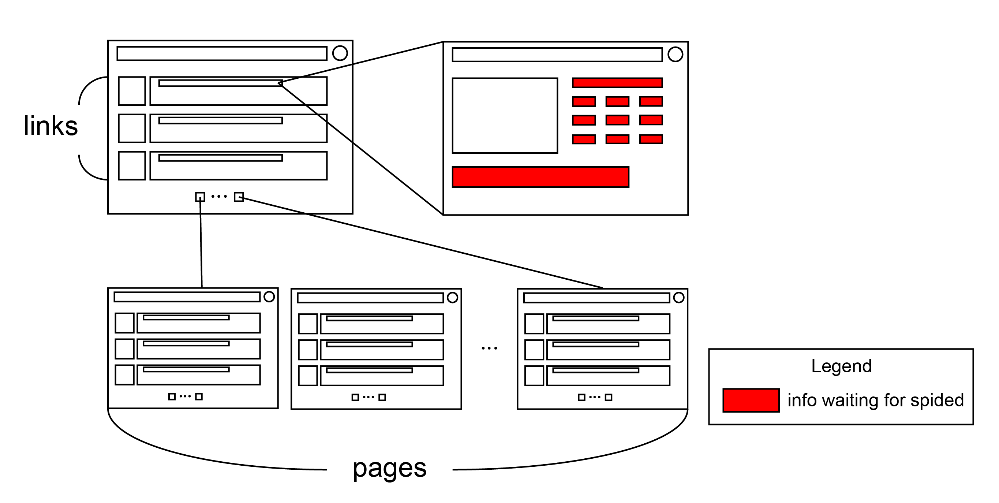
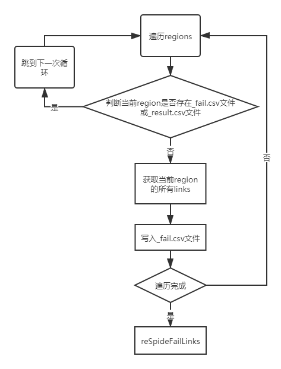

# region-based-crawler

这是一款只需要具备简单的静态页面解析能力，就可以多线程爬取所需数据并存入CSV文件的通用型脚本框架。基于`模板方法设计模式`，将爬虫通用框架抽象为AbstractSpiderFrame类，你只需要修改继承该父类的具体子类，以此实现不同页面的解析脚本。

相关博文见：[https://blog.csdn.net/lyandgh/article/details/109599132](https://blog.csdn.net/lyandgh/article/details/109599132)

<!-- MarkdownTOC autolink='true' autoanchor='true' -->

- [适用页面模式](#%E9%80%82%E7%94%A8%E9%A1%B5%E9%9D%A2%E6%A8%A1%E5%BC%8F)
- [环境及依赖包](#%E7%8E%AF%E5%A2%83%E5%8F%8A%E4%BE%9D%E8%B5%96%E5%8C%85)
- [代码结构](#%E4%BB%A3%E7%A0%81%E7%BB%93%E6%9E%84)
- [使用方式](#%E4%BD%BF%E7%94%A8%E6%96%B9%E5%BC%8F)
	- [执行文件（以chuzu__init__.py为例）](#%E6%89%A7%E8%A1%8C%E6%96%87%E4%BB%B6%EF%BC%88%E4%BB%A5chuzu__init__py%E4%B8%BA%E4%BE%8B%EF%BC%89)
	- [子类文件（以chuzuSpider.py为例）](#%E5%AD%90%E7%B1%BB%E6%96%87%E4%BB%B6%EF%BC%88%E4%BB%A5chuzuspiderpy%E4%B8%BA%E4%BE%8B%EF%BC%89)
- [容错机制](#%E5%AE%B9%E9%94%99%E6%9C%BA%E5%88%B6)
- [案例](#%E6%A1%88%E4%BE%8B)
- [免责声明](#%E5%85%8D%E8%B4%A3%E5%A3%B0%E6%98%8E)

<!-- /MarkdownTOC -->


<a id="%E9%80%82%E7%94%A8%E9%A1%B5%E9%9D%A2%E6%A8%A1%E5%BC%8F"></a>
## 适用页面模式

该爬虫适用于`分区域=>分页面=>分链接=>目标页面`的模式，具体来说，我们要爬一个城市的所有信息，基本都会分区，我们第一步就是要根据各个区来构成`regions`链接；然后我们遍历这些链接，去获取各个链接的分页数，然后根据分页数和当前链接构成`pages`；然后我们遍历`pages`，去获取每个分页中所有详情页的链接`links`（这个`links`就是我们要爬取的所有详情页的链接池）；最后，遍历`links`爬取详情页，存入csv文件。

抽象出来的框架如下图：



<a id="%E7%8E%AF%E5%A2%83%E5%8F%8A%E4%BE%9D%E8%B5%96%E5%8C%85"></a>
## 环境及依赖包

>环境

- Python 3.x+

>依赖包

- requests
- csv
- logging

<a id="%E4%BB%A3%E7%A0%81%E7%BB%93%E6%9E%84"></a>
## 代码结构

- spider.py（抽象父类，架构核心，无需用户改动）
- chuzuSpider.py（具体子类，需要继承父类，重写四个方法，需要用户改动）
- chuzu__init.py（执行文件，需要引用子类并实例化、调用固定的方法，需要用户改动）

<a id="%E4%BD%BF%E7%94%A8%E6%96%B9%E5%BC%8F"></a>
## 使用方式

用户需要修改以下两个文件：

<a id="%E6%89%A7%E8%A1%8C%E6%96%87%E4%BB%B6%EF%BC%88%E4%BB%A5chuzu__init__py%E4%B8%BA%E4%BE%8B%EF%BC%89"></a>
#### 执行文件（以chuzu__init__.py为例）

- THREAD_MAX：线程数
- TIMESPAN：总时间间隔，多线程的话实际间隔为 THREAD_MAX/TIMESPAN
- DICT_PATH：用于存储日志和结果文件的文件夹相对路径
- regions：可用于组装url的区域列表，如['hongshan','hannan',...]
- fields：详情页实际需要爬取的字段的字段名列表，如['title','date','price','detail',...]

_TIMESPAN和THREAD_MAX决定了爬虫的实际时间间隔，选择合适的参数，不要过短（给目标网站造成太大的压力）也不要过长（程序耗时过久）。_

```python
# 实例化子类chuzuSpider
app = chuzuSpider(...)
# 执行爬虫
app.run()
```

>run函数内部的原理



如果文件夹内存在_fail.csv文件，需要多次运行__init__.py文件，每次运行都会重新爬取_fail.csv文件中的链接，直到没有失败链接，会自动删除_fail.csv。

_需要注意的是，_fail.csv文件中的链接可能是本身就失效的链接，这些链接是无法爬取成功的，需要手动删除。_

<a id="%E5%AD%90%E7%B1%BB%E6%96%87%E4%BB%B6%EF%BC%88%E4%BB%A5chuzuspiderpy%E4%B8%BA%E4%BE%8B%EF%BC%89"></a>
#### 子类文件（以chuzuSpider.py为例）

该子类有五个方法需要重写，分别是：

1. getEntryFunc
2. getPagesFunc
3. getLinkListFunc
4. processLinksFunc
5. urlIsVaild

>getEntryFunc

该函数输入region，输出处理后的url

```python
# 示例
region = 'hongshan'
output = 'http://wh.ganji.com/'+region+'/zufang/'
```

>getPagesFunc

该函数输入getEntryFunc输出的url，输出所有分页链接的list

```python
# 示例
url = 'http://wh.ganji.com/hongshan/zufang/'
output = 
['http://wh.ganji.com/hongshan/zufang/pn1/',
'http://wh.ganji.com/hongshan/zufang/pn2/',
'http://wh.ganji.com/hongshan/zufang/pn3/',
...]
```

>getLinkListFunc

该函数输入getPagesFunc输出的list的每个url，输出分页所有详情页的链接list，如果爬取或解析异常，则输出False

```python
# 示例
url = 'http://wh.ganji.com/hongshan/zufang/pn1/'
output = 
['http://wh.ganji.com/zufang/43817179368486x.shtml',...]
```

_注意：这里之所以返回False，而不是返回[]，是因为有些分页可能没有详情页链接，比如最后一页可能只有广告位。因此[]并不能完全代表爬取或解析失败。_

>processLinksFunc

该函数输入详情页的url，输出fields顺序的字段值list，如果爬取或解析异常，则输出空列表[]

```python
# 示例
url = 'http://wh.ganji.com/zufang/43817179368486x.shtml'
output = ['无中介白沙洲黄家湖武汉工商学院旁胜利丰园精装三室两厅','1100 元/月','3室2厅2卫','整租120㎡',...]
```

>urlIsVaild

该函数输入待爬url，输出布尔值，如果该链接有效，则输出True，否则输出False

该函数的作用是提前设定一些规则，判定链接是否有效，比如根据链接的长度（如赶集网的无效链接长度是25，正常链接是23），因此可以根据链接长度判断是否有效，若有效，则正常爬取，否则直接跳过，且不写入fail文件，以免反复爬取无效链接，无法跳出。

```python
# 示例
url_vaild = 'https://wh.58.com/ershoufang/44045796114448x.shtml'
url_invaild = 'https://wh.58.com/ershoufang/1577597707346950x.shtml'
```

另外，子类名可自定义。

<a id="%E5%AE%B9%E9%94%99%E6%9C%BA%E5%88%B6"></a>
## 容错机制

爬虫必然存在漏爬或解析错误的问题。region-based-crawler对漏爬或未成功的链接采取存入csv文件的措施，因为这样更可控。另外，目标文件夹下的日志文件（log.txt），也可以帮助你定位一些失败原因。但是日志仅限spider.py文件，也就是说如果子类中的错误不会记录在日志文件中。当然你也可以往子类引入日志文件，但前提要保证四个重写的函数的输入和输出不受影响。

当一个区域的所有链接爬取结束，会输出两种文件，'区域名\_result.csv'和'区域名\_fail.csv'。其中爬取失败的链接会以`type,region,url`的格式记录到fail.csv中，该文件无需用户手动修改。

需要注意的是，在一个区域链接未全部爬取完毕的时候终止程序或程序崩溃，都不会输出结果文件，因为爬取过程中的结果是缓存在内存里的。为了保证程序正常运行，请在四个重写函数中，特别是页面解析的代码处，尽量使用`try catch`把异常捕获了，让程序正常运行。

<a id="%E6%A1%88%E4%BE%8B"></a>
## 案例

以赶集网为例，我们想要爬取赶集网中武汉市所有地区的租房信息。步骤如下：


<a id="%E5%85%8D%E8%B4%A3%E5%A3%B0%E6%98%8E"></a>
## 免责声明

**特别提醒**：请严格遵守网站根目录下的robots.txt协议，如果有很强的需求，请设定较长的时间间隔，如30秒。

region-based-crawler遵循GPL-3.0开源协议，本人对任何人使用该爬虫代码产生的任何后果都不会负责。